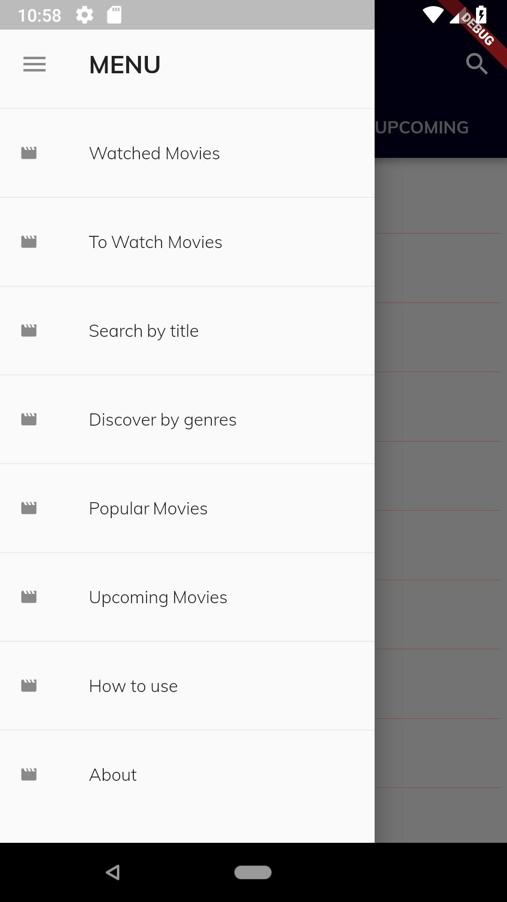
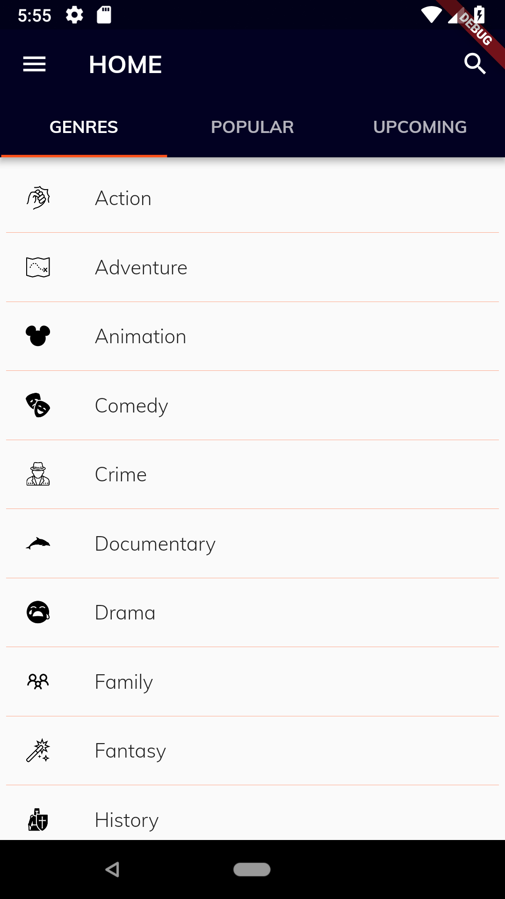

# Cine-Data

Cine-Data is an android app movie tracker that was made with flutter and uses TMDB Api.

# Screenshots

| Home Screen | Info Page |
| ------------------ | ------------------ |
|   |   |

| Watched list Screen | Watchlist Screen |
| ------------------ | ------------------ |
|   |   |

| Drawer Screen | Search Screen |
| ------------------ | ------------------ |
|   |   |

| Genres list Screen | Genre Screen |
| ------------------ | ------------------ |
|   |   |
